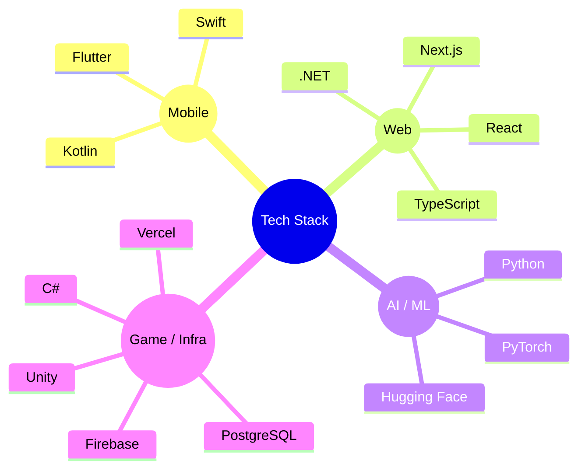

<!-- 283 Production · Shiny Colors Theme -->

  
  

  

  

## 🖥️ Tech Stack

```mermaid
mindmap
  root((Tech Stack))
    ((Mobile))
      Flutter
      Swift
      Kotlin
    ((Web))
      TypeScript
      React
      Next.js
      .NET
    ((AI / ML))
      Python
      PyTorch
      Hugging Face
    ((Game / Infra))
      Unity
      C#
      Firebase
      PostgreSQL
      Vercel
```
