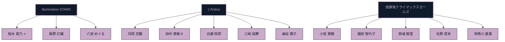
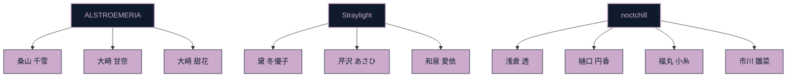
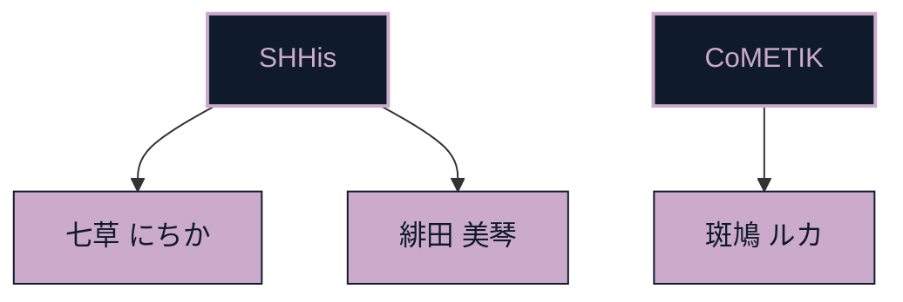

<!-- 283 Production · Shiny Colors Theme -->

  

  

  
  &nbsp;
  
  &nbsp;
  

  <b>🌸 桜木 真乃</b> &nbsp;·&nbsp; <b>💛 八宮 めぐる</b> &nbsp;·&nbsp; <b>💙 風野 灯織</b>

<h2 align="center">💎 シャイニーカラーズ</h2>

---

<h3 align="left">🌐 Browser</h3>

  

## 🖥️ Tech Stack — Produce Units

### 📱 Mobile Unit ・ The Center Stage

**Languages**

  
  
  
  

**Frameworks / SDK**

  
  
  
  
  
  
  

**Dependency Manager**

  
  

### 🌐 Web Unit ・ Bright Stage

**Languages**

  
  
  
  
  
  

**Frameworks**

  
  
  
  

### 🤖 AI / ML Unit ・ Backstage Lab

**Languages**

  

**Libraries / Frameworks**

  
  
  

**Notebook**

  

### 🎮 Game ・ Hardware Unit ・ After-School Workshop

**Languages**

  
  

**Engines / Tools**

  
  
  

### ☁️ Cloud ・ DB Unit ・ Beyond the Stage

**Cloud / Hosting**

  
  
  
  

**Database**

  
  

**Server / Env**

  
  

### 🛠️ Producer's Desk ・ OS & Tooling

**OS**

  
  
  
  

**IDE**

  
  
  
  
  
  

**Tools**

  
  

---

<h2 align="center">📊 GitHub Stats</h2>

  
  

  

---

<h2 align="center">📈 GitHub Activity Graph</h2>

  

---

<h2 align="center">🪄 Metrics</h2>

  

